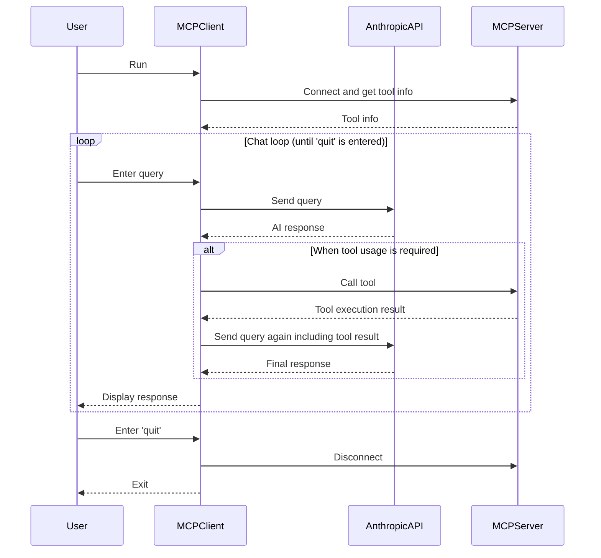

# Mcp client example

This is a sample CLI chat application for an AI assistant using the Anthropic API in conjunction with an MCP client and MCP server.

Reference:
[For Client Developers - Model Context Protocol](https://modelcontextprotocol.io/quickstart/client#node)

Anthropic API:
[Initial setup - Anthropic](https://docs.anthropic.com/en/docs/initial-setup)
[Messages - Anthropic](https://docs.anthropic.com/en/api/messages)

<b>System diagram</b>


<b>Sequence diagram</b>



## Setup

```bash
pnpm install
```

.env
```txt
ANTHROPIC_API_KEY=your-api-key
MCP_SERVER_SCRIPT_PATH=/path/to/mcp-server.js
```

## Run

```bash
pnpm start
```

### Output example

Use this mcp server
https://github.com/t-shiratori/time-tools-mcp-server

```shell-session

mcp-client-example $ pnpm start

> mcp-client-example@1.0.0 start /path/to/mcp-client-example
> node build/index.js

Example MCP Server running on stdio
Connected to server with tools: [ 'get_current_date_time', 'get_elapsed_time' ]

MCP Client Started!
Type your queries or 'quit' to exit.

🖌 Query: Hello

Hello! I'm here to assist you. I can help you with tasks related to date and time, such as getting the current date and time or calculating the elapsed time between two dates.

Is there something specific you'd like to know about dates or times today?

🖌 Query: What time is it?

I can check the current date and time for you.
[Calling tool get_current_date_time with args {}]
Based on the given timestamp, the time is 10:37:19 AM on May 6th, 2025.

```
